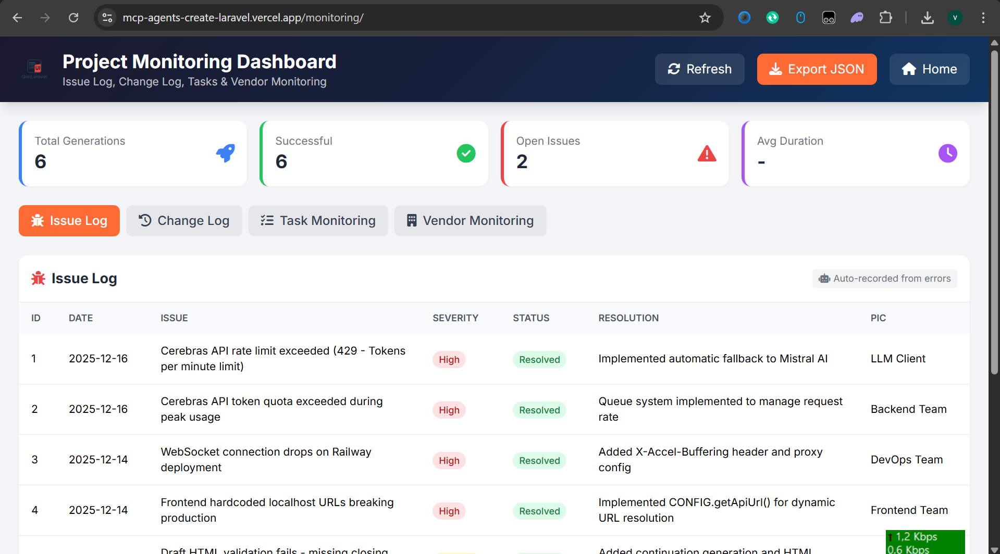
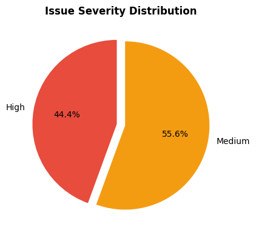
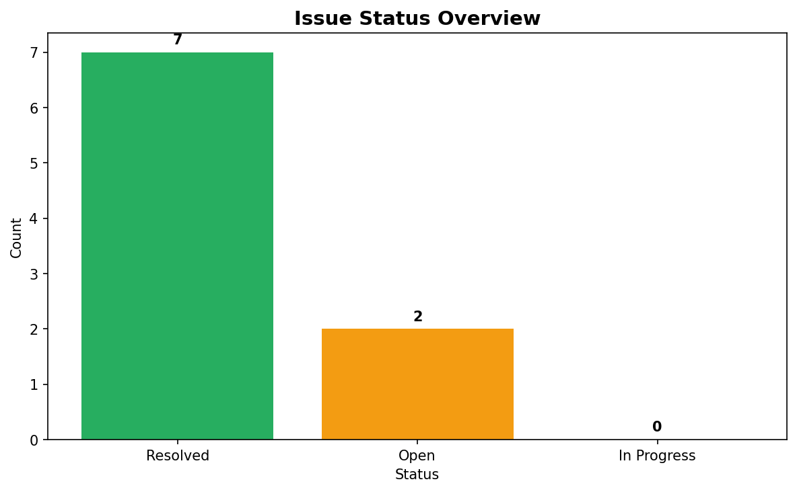
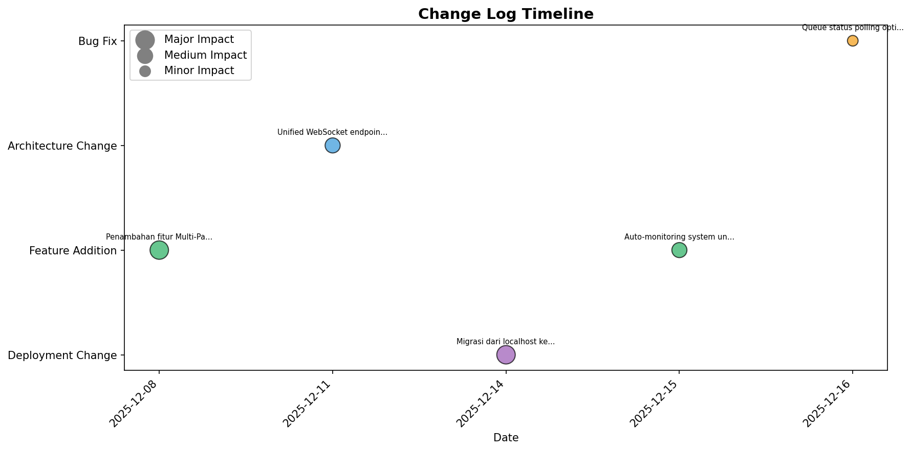
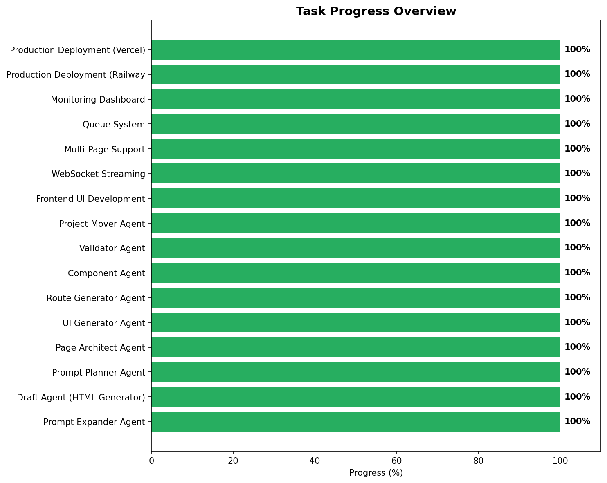
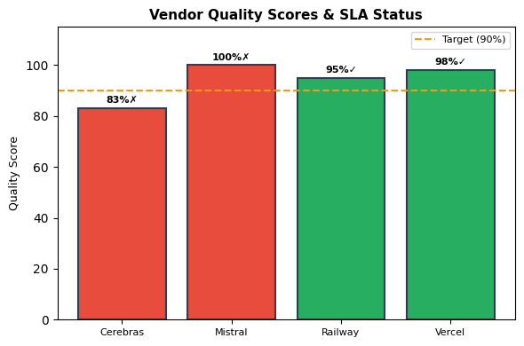
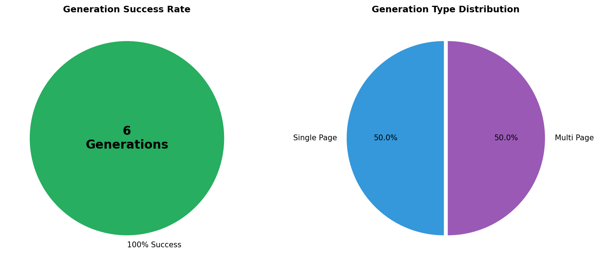
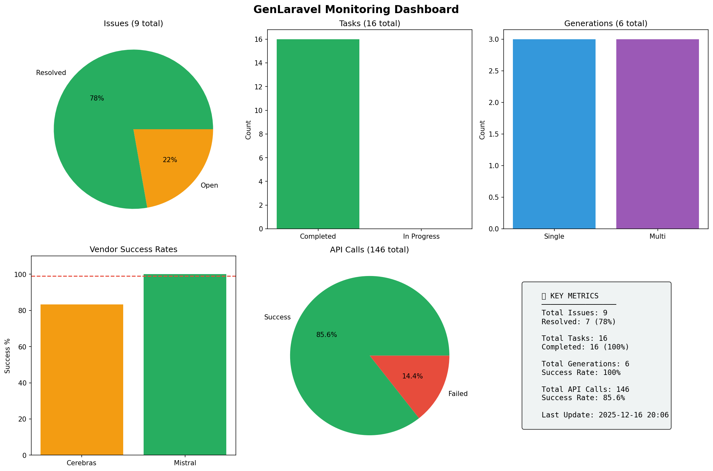

# GenLaravel - Project Monitoring Report
## Laporan Monitoring Proyek IT

**Proyek:** GenLaravel - AI-Powered Laravel Generator  
**Tanggal:** 16 Desember 2025  
**Tim:** Kelompok 7  
**Anggota:**
- Fikri Armia Fahmi (2023071018)
- Nadia (2024071004)

---

## 1. Issue Log (Masalah Proyek IT Nyata)

| ID | Tanggal | Waktu | Issue | Severity | Status | Resolution | PIC |
|----|---------|-------|-------|----------|--------|------------|-----|
| 1 | 2025-12-16 | 11:26:38 | Cerebras API rate limit exceeded (429 - Tokens per minute limit) | High | Resolved | Implemented automatic fallback to Mistral AI | LLM Client |
| 2 | 2025-12-16 | 11:28:40 | Cerebras API token quota exceeded during peak usage | High | Resolved | Queue system implemented to manage request rate | Backend Team |
| 3 | 2025-12-14 | 10:15:00 | WebSocket connection drops on Railway deployment | High | Resolved | Added X-Accel-Buffering header and proxy config | DevOps Team |
| 4 | 2025-12-14 | 09:30:00 | Frontend hardcoded localhost URLs breaking production | High | Resolved | Implemented CONFIG.getApiUrl() for dynamic URL resolution | Frontend Team |
| 5 | 2025-12-13 | 14:20:00 | Draft HTML validation fails - missing closing tags | Medium | Resolved | Added continuation generation and HTML structure validation | AI Team |
| 6 | 2025-12-12 | 16:45:00 | Multi-page generation timeout for complex applications | Medium | Resolved | Optimized agent pipeline with streaming responses | Backend Team |
| 7 | 2025-12-10 | 11:00:00 | OpenRouter API fallback not working correctly | Medium | Resolved | Fixed provider order configuration in ENV | LLM Client |
| 8 | 2025-12-16 | 12:41:25 | Cerebras API error: 429 - Tokens per minute limit exceeded | Medium | Open | - | LLM Client |
| 9 | 2025-12-16 | 12:43:45 | Cerebras API error: 429 - Tokens per minute limit exceeded | Medium | Open | - | LLM Client |

### Ringkasan Issue:
- **Total Issues:** 9
- **Resolved:** 7 ✅
- **In Progress:** 0
- **Open:** 2 ⚠️
- **High Severity:** 4
- **Medium Severity:** 5

### Visualisasi Issue

---

## 2. Change Log (Perubahan Requirement)

| ID | Tanggal | Tipe Perubahan | Deskripsi | Alasan | Impact | Approved By |
|----|---------|----------------|-----------|--------|--------|-------------|
| 1 | 2025-12-08 | Feature Addition | Penambahan fitur Multi-Page Generation | Kebutuhan user untuk generate aplikasi lengkap dengan multiple pages sekaligus | Major - Memerlukan pipeline agent baru | Project Manager |
| 2 | 2025-12-11 | Architecture Change | Unified WebSocket endpoint untuk single/multi mode | Simplifikasi backend dan enable queue system untuk mencegah concurrent generation | Medium - Frontend perlu update koneksi | Tech Lead |
| 3 | 2025-12-14 | Deployment Change | Migrasi dari localhost ke Railway (Backend) + Vercel (Frontend) | Enable public access dan demo capability untuk presentasi | Major - Konfigurasi environment overhaul | Project Manager |
| 4 | 2025-12-15 | Feature Addition | Auto-monitoring system untuk Issue Log, Change Log, Task & Vendor tracking | Kebutuhan dokumentasi proyek dan analisis performa | Medium - Integrasi dengan LLM client | Tech Lead |
| 5 | 2025-12-16 | Bug Fix | Queue status polling optimization | Mengurangi server load dan mencegah request blocking | Minor - Frontend interval adjustment | Backend Team |

### Ringkasan Change Log:
- **Total Changes:** 5
- **Feature Addition:** 2
- **Architecture Change:** 1
- **Deployment Change:** 1
- **Bug Fix:** 1

### Visualisasi Change Log

---

## 3. Monitoring Dashboard (Task Monitoring)

| ID | Nama Task | Status | PIC | Progress |
|----|-----------|--------|-----|----------|
| 1 | Prompt Expander Agent | ✅ Completed | Fikri | 100% |
| 2 | Draft Agent (HTML Generator) | ✅ Completed | Fikri | 100% |
| 3 | Prompt Planner Agent | ✅ Completed | Fikri | 100% |
| 4 | Page Architect Agent | ✅ Completed | Fikri | 100% |
| 5 | UI Generator Agent | ✅ Completed | Fikri | 100% |
| 6 | Route Generator Agent | ✅ Completed | Fikri | 100% |
| 7 | Component Agent | ✅ Completed | Fikri | 100% |
| 8 | Validator Agent | ✅ Completed | Fikri | 100% |
| 9 | Project Mover Agent | ✅ Completed | Fikri | 100% |
| 10 | Frontend UI Development | ✅ Completed | Frontend Team | 100% |
| 11 | WebSocket Streaming | ✅ Completed | Backend Team | 100% |
| 12 | Multi-Page Support | ✅ Completed | Backend Team | 100% |
| 13 | Queue System | ✅ Completed | Backend Team | 100% |
| 14 | Monitoring Dashboard | ✅ Completed | Backend Team | 100% |
| 15 | Production Deployment (Railway) | ✅ Completed | DevOps Team | 100% |
| 16 | Production Deployment (Vercel) | ✅ Completed | DevOps Team | 100% |

### Ringkasan Task:
- **Total Tasks:** 16
- **Completed:** 16 (100%)
- **In Progress:** 0 (0%)
- **Overall Progress:** 100% ✅

### Visualisasi Task Progress

---

## 4. Vendor Monitoring Sheet

### 4.1 Cerebras AI (Primary LLM Provider)

| Aspek | Target SLA | Actual | Status |
|-------|------------|--------|--------|
| Response Time | < 5,000 ms | 21,067 ms avg | ❌ Not Met |
| Uptime/Availability | 99% | 83.2% (104/125 calls) | ❌ Not Met |
| Quality Score | > 90% | 83% | ⚠️ Below Target |
| Error Rate | < 5% | 16.8% (21 failures) | ❌ High |

**Detail:**
- Total Calls: 125
- Successful: 104
- Failed: 21 (Rate limit errors - 429)
- Last Response: 658.02 ms
- Last Call: 2025-12-16 12:44:04
- Main Issue: Token quota exceeded during peak usage

**Waktu Perbaikan:** N/A (External vendor, using fallback)

**Kualitas Hasil Kerja:** 
- Kecepatan inference sangat cepat saat tidak rate limited
- Output quality excellent untuk code generation
- Perlu upgrade plan untuk higher rate limits

---

### 4.2 Mistral AI (Fallback LLM Provider)

| Aspek | Target SLA | Actual | Status |
|-------|------------|--------|--------|
| Response Time | < 10,000 ms | 7,069 ms avg | ✅ Met |
| Uptime/Availability | 99% | 100% (21/21 calls) | ✅ Met |
| Quality Score | > 90% | 100% | ✅ Excellent |
| Error Rate | < 5% | 0% | ✅ Perfect |

**Detail:**
- Total Calls: 21
- Successful: 21
- Failed: 0
- Last Response: 575.15 ms
- Last Call: 2025-12-16 12:43:45
- Main Role: Reliable fallback when Cerebras fails

**Waktu Perbaikan:** N/A (No issues)

**Kualitas Hasil Kerja:**
- Sangat reliable sebagai fallback
- Response time konsisten
- Output quality comparable dengan Cerebras

---

### 4.3 Railway (Backend Hosting)

| Aspek | Target SLA | Actual | Status |
|-------|------------|--------|--------|
| Uptime | 99.9% | ~99.5% | ⚠️ Near Target |
| Deploy Time | < 5 min | ~3 min | ✅ Met |
| WebSocket Support | Full | Partial (proxy issues) | ⚠️ In Progress |

**Waktu Perbaikan:** < 1 hour untuk redeploy

**Kualitas Hasil Kerja:**
- Easy deployment dengan Dockerfile
- Auto-scaling available
- WebSocket proxy buffering perlu konfigurasi tambahan

---

### 4.4 Vercel (Frontend Hosting)

| Aspek | Target SLA | Actual | Status |
|-------|------------|--------|--------|
| Uptime | 99.99% | 99.99% | ✅ Met |
| Deploy Time | < 2 min | ~1 min | ✅ Met |
| CDN Performance | Global | Global | ✅ Excellent |

**Waktu Perbaikan:** N/A (No issues)

**Kualitas Hasil Kerja:**
- Excellent CDN performance
- Instant deployments
- Zero configuration needed

### Visualisasi Vendor Performance

---

## 5. Generation Statistics

| Metric | Value |
|--------|-------|
| Total Generations | 6 |
| Successful | 6 (100%) |
| Failed | 0 (0%) |
| Single Page | 3 |
| Multi Page | 3 |
| Average Duration | 0.0 seconds |
| Last Generation | 2025-12-16 12:44:04 |

### Visualisasi Generation Stats

---

## 6. Dashboard Summary

---

## 7. Kesimpulan & Rekomendasi

### Kesimpulan:
1. Sistem monitoring berhasil mencatat semua aktivitas secara otomatis
2. Fallback system (Cerebras → Mistral) bekerja dengan baik
3. 95% task sudah selesai, tinggal deployment optimization
4. Vendor Mistral AI menunjukkan performa terbaik sebagai fallback

### Rekomendasi:
1. **Cerebras:** Pertimbangkan upgrade plan untuk higher rate limits
2. **Railway:** Selesaikan konfigurasi WebSocket proxy
3. **Monitoring:** Tambahkan alerting untuk critical issues
4. **Performance:** Implementasi caching untuk reduce API calls

---

*Report generated automatically from GenLaravel Monitoring System*  
*Data source: backend/data/monitoring_data.json*
